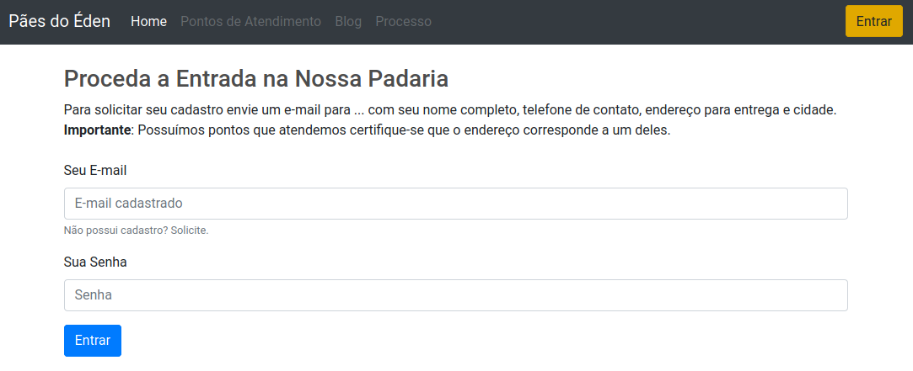
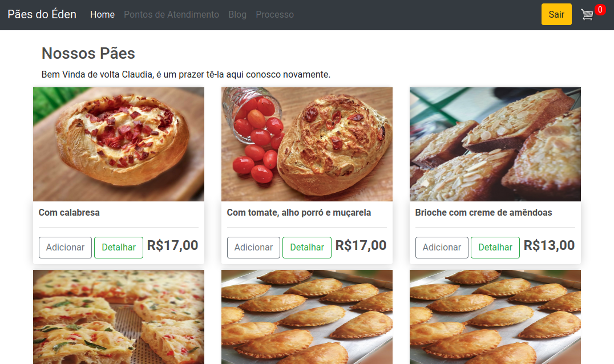
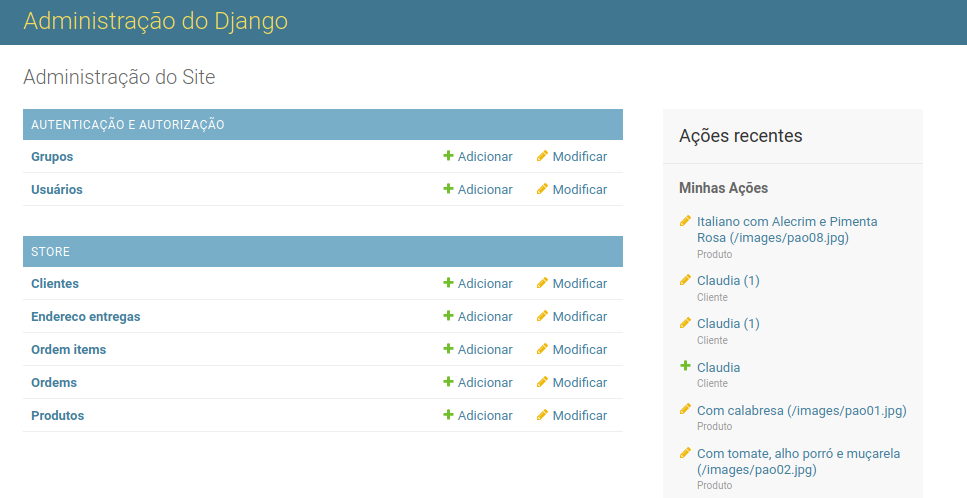

# eCommerce
Este é um projeto Open Source completo para um Site eCommerce em Django. O objetivo é um modelo de concepção para uma loja virtual (que pode ser para a venda de qualquer produto) com a utilização dos seguintes softwares:
* Django - Versão 3.1
* Bootstrap (futuramente será modificado para o Material) para responsividade das telas
* JavaScript e CSS3

## Escopo do Projeto
Este eCommerce é uma Padaria Virtual construída com o Django, a tela inicial mostra a "vitrine" de produtos disponíveis:

Para comprar o cliente deve realizar um registro e acessar o site (todo o controle é realizado pelo Administrador):

Uma vez escolhidos os produtos o cliente pode entrar no seu carrinho para escolher as quantidades, ou remover os produtos selecionados:

Uma vez definido os produtos e a quantidade, o cliente pode proceder o pagamento:

## Vantagens no uso do Django
Não existe a necessidade de se criar telas administrativas para cadastro e manutenção dos produtos e clientes, tudo é realizado pelo administrador do Django:

## Instalação desse projeto
Por questões de segurança foi retirada a chave SECRET_KEY do Arquivo settings.py, então para fazer o projeto rodar:

1. Criar um projeto Django.
2. Esse projeto conterá o arquivo settings.py com a sua chave de segurança (guarde-a).
3. Clone este projeto.
4. Coloque a chave de segurança guardada no arquivo settings.py.

## Situação do Projeto

Este projeto ainda está em desenvolvimento, atualmente está pronto e funcional:

### Versão 1.0
* Definição do modelo de dados
* Concepção das telas com responsividade
* Tela Inicial
* Login e Logout
* Bloqueio de compra para clientes que não são cadastrados
* Adição dos itens no Carrinho de Compras
* Manipulação do Carrinho de Compras
* Fechamento do Pedido