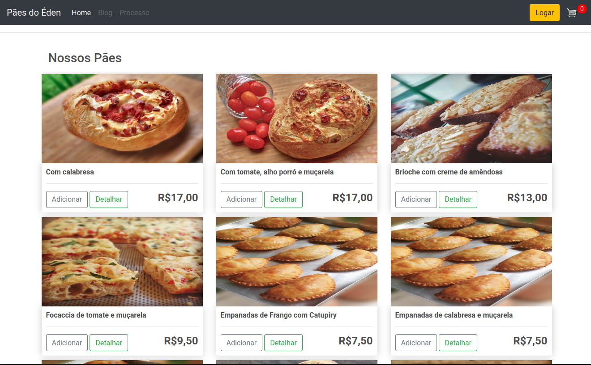
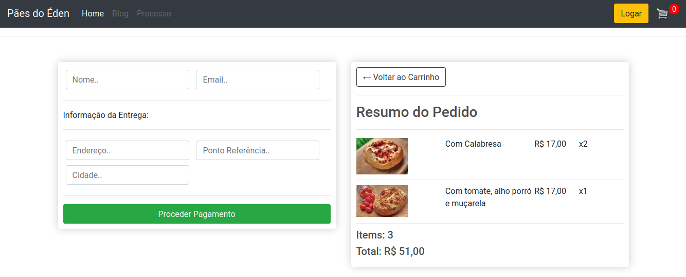

# eCommerce
Este é um exemplo completo para um Site eCommerce em Django (ainda em produção).

## Escopo do Projeto
Este eCommerce é uma Padaria Virtual construída com o Django, a tela inicial mostra a "vitrine" de produtos disponíveis:

Para comprar o cliente deve realizar um registro e acessar o site (todo o controle é realizado pelo Administrador), com os produtos escolhidos o cliente pode entrar no seu carrinho para escolher as quantidades, ou remover os produtos selecionados:

Uma vez definido os produtos e a quantidade, o cliente pode proceder o pagamento:

## Situação do Projeto

Este projeto ainda está em desenvolvimento, atualmente está pronto e funcional:
* Definição do modelo de dados
* Concepção das telas com responsividade
* Tela Inicial
* Login e Logout
* Bloqueio de compra para clientes que não são cadastrados
